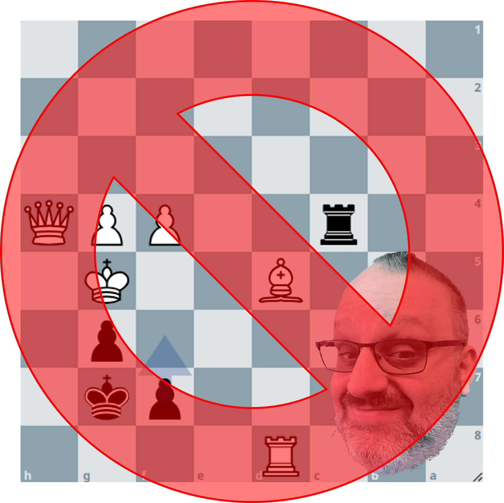

# Finegold Chess

Grandmaster Ben Finegold has [some thoughts](https://www.reddit.com/r/chess/comments/e4m2ae/does_someone_know_all_or_some_of_ben_finegolds/) on how you ought to play chess.

In his videos and lectures Ben sets out a number of general pieces of advice which he sarcastically refers to as *rules*, including:
 * Never play f6 (or f3)
 * Always play Kb1 (or Kb8)
 * Always play Bf8 (or Bf1)
 * Always sac the exchange

These rules are generally helpful - playing f6 or f3 weakens your king, Kb1 after castling long helps get it out of the center, and a bishop on f8 is a good defensive resource.  Of course these moves aren't always the best idea and are sometimes downright silly.  They are overly-broad tongue-in-cheek suggestions, not rules.  

But what if they were?

In this project I'm attempting to implement Ben's rules in a fork of the open-source chess engine [Stockfish](https://stockfishchess.org/), then explore their consequences (particularly on opening play).  The end goal of this project is a funcitonal FinegoldFish bot, available for play through Lichess, using the UCI interface.

As I progress I'll update the list of discussion blog posts below.
* [Modifying Stockfish's `movegen.cpp` file](./posts/forking_stockfish.md)
* [How I stopped worrying and learned to love f6](./posts/lichess_blog_f6.md)

## License
This project is licensed under the GNU General Public License v3.0 (GPL-3.0).  
It includes the Stockfish chess engine, which is also licensed under GPL-3.0.  

- Stockfish repository: [https://github.com/official-stockfish/Stockfish](https://github.com/official-stockfish/Stockfish)
- GPL-3.0 License: [https://www.gnu.org/licenses/gpl-3.0.en.html](https://www.gnu.org/licenses/gpl-3.0.en.html)

