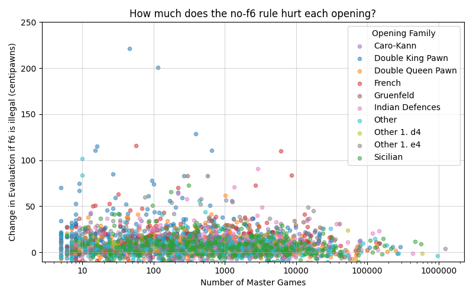
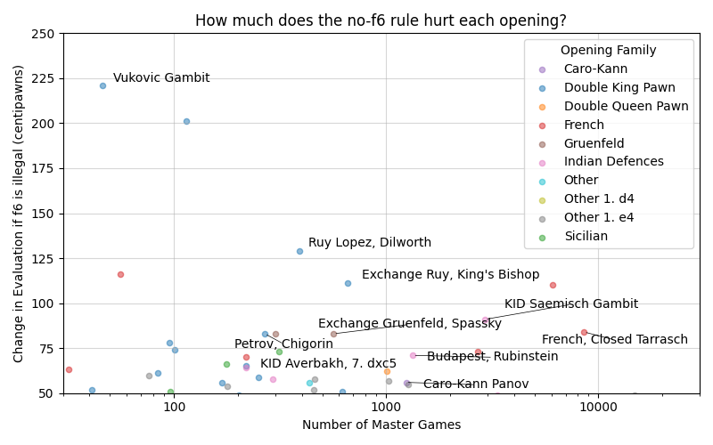
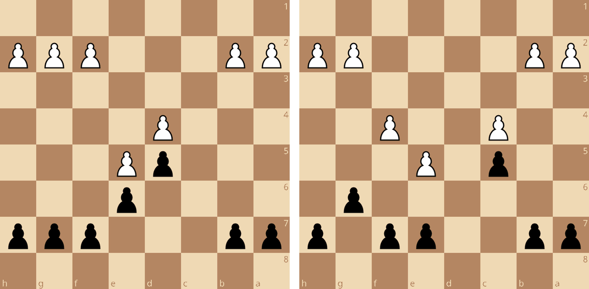

# Exploring Finegold Chess
## Or, How I Learned To Stop Worrying and Love ..f6!

Grandmaster Ben Finegold has [some thoughts](https://www.reddit.com/r/chess/comments/e4m2ae/does_someone_know_all_or_some_of_ben_finegolds/) on how you ought to play chess.

In videos and lectures Ben espouses nuggets of advice which he sarcastically calls his *rules*, including the rule **never play f6**.  His rules are generally helpful (f6 weakens your king, after all) but of course they aren't right for every position and are sometimes downright silly. **Never play f6** is an overly-broad tongue-in-cheek suggestion, not a rule. 

But what if it was?

It turns out we can build a world without f6, and it's absence teaches us about the many ways in which f6 can help our position.

Here's the plan:
1. Modify the [Stockfish](https://stockfishchess.org/) engine to make a version that  thinks the move pawn to f6 is illegal.  We'll call it **FinegoldFish**
2. Evaluate every named opening in the Encyclopedia of Chess Openings (ECO) using both FinegoldFish and Stockfish 
3. Compare those evaluations to measure how much of a penalty the 'no f6' rule gives
4. Find some openings that are both a) popular, and b) heavily penalized by the 'no f6' rule
5. Play through some games to try to figure out, in words and variations, why f6 is such an important resource in those lines

## Opening DB Analysis
The figure below shows ~2000 dots, each one representing a named position in the ECO.  The horizontal axis shows popularity in master play (using the Lichess Database), and the vertical axis shows `FinegoldFish_Evaluation - Stockfish_Evaluation`[^1], measured in centipawns (where 100 centipawns = 1 pawn).  Openings further to the right are more popular, and openings higher on the graph are more heavily punished by Ben's rule.

The vast majority of openings have little to no difference, and that makes sense.  For example, in the Dutch after `1. d4 f5`, f6 is never a legal move for black so the Finegold rule is totally irrelevant.  Even lines where f6 is *one of* black's main plans won't be affected - black just needs some decent alternate plan that don't involve f6.  Despite this, the graph shows some openings become up to two pawns worse if f6 is forbidden.  That's a huge shift!  Let's zoom in on the top of the graph to see what they are.

I've labeled a few of the openings.  If you're curious about where your favourite line falls on this graph you can search for it in the full results spreadsheet here: [ECO Openings Analyzed](https://github.com/WillBeattie/Finegold_Chess/blob/master/results/ECO_w_Master_Games_Evaluated.csv).

So far all we know a few things about the no-f6 rule:
* Most openings aren't too badly affected
* Some openings take a big hit, losing over a pawn's worth of eval
* Many of the badly hurt openings are in 1. e4, particularly 1.e4 e5

What we don't know is why.  What is it about the Vukovic Gambit that stinks so much if black can't play f6?  To answer this we can play out some of those punished positions with the help of Stockfish, FinegoldFish, and the master's database.

## Reasons You Might Need to Play f6 
I selected ten openings that are both popular and punished by the no-f6 rule and created a study to explore why: [Study - Never Play f6??](https://lichess.org/study/9HUPUTCa).  In each line the move f6 is a key resource for black, but for different reasons.  I've grouped them accordingly, and we'll look at an example of each below.

### Tactical Necessity - Vukovic Gambit
Probably the most convincing and least interesting examples of the lot, sometimes f6 is simply the only move to prevent immediate material loss.  Being able to repel a white bishop after it moves to g5 seems to be particularly thematic.

https://lichess.org/study/9HUPUTCa/0vmC6G3v#13

### Contest The White Pawn Center - French Tarrasch
A more familiar reason for f6 comes from closed French structures, which I get a lot as a lover of the Caro-Kann and French.  Typically in these positions Black can't hope to play around white's center and instead must attack it.  It's most common to attack the base of the pawn chain with c5, but attacking the head with f6 is often an important option as well. 

https://lichess.org/study/9HUPUTCa/kfDQhlkN#15

If you find yourself facing one of these pawns structures, you should consider the move f6!

### Open the f-file to Attack! - Ruy Lopez, Dilworth
The Dilworth Ruy Lopez is the only variation I found with f6 as an offensive weapon.  Here black gets a big initiative but has poor long-term chances, and therefore needs to open lines.  The move f6 is played to open the f-file for black's rook and queen before the white king finds safety. 

https://lichess.org/study/9HUPUTCa/BjTIOAq0#23

### Dark Square King Safety - Gruenfeld, Main Line
Of the many variations of the Gruenfeld this is perhaps the most popular, and it downright stinks without f6.  White sacrifices the exchange to get Black's Gruenfeld fianchettoed bishop, leaving the dark squares around black's king vulnerable.  The move f6 is badly needed to block the long diagonal
https://lichess.org/study/9HUPUTCa/tpf4kQ8k#26

## Conclusion

f6 is a wonderful move, tactical and strategic, offensive and defensive, and is worthy of our love.  

I hope you enjoyed this exploration.  

[^1] Evaluations done at depth 30